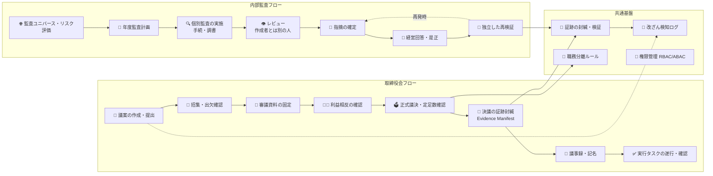

# 🏛️ みらい取締役会・監査統合基盤（Mirai Board & Audit Governance Hub）

> 📌 **「取締役会」と「内部監査」の一連の流れを、証跡（証拠）を残しながら一つの画面で見える化する、統制・証跡ハブ（MVP／Prototype）です。**
>
> ⚠️ 本システムのデータはすべて**架空のデモ用データ**です。実在の人物・会社・情報は含まれません。

---

## 🎯 これは何？（ひとことで）

取締役会の「招集 → 審議 → 決議 → 議事録 → 実行」と、内部監査の「計画 → 調査 → 指摘 → 是正 → 再確認」という**会社にとって大切な2つの流れ**を、✅誰が・📅いつ・📄どんな資料で決めたのかを**後から検証できる形で記録**しながら、一つの追跡画面で管理するためのシステムです。

いわば、会社の意思決定と監査の**「デジタル証跡（あしあと）台帳」**です。紙とExcelでバラバラだった情報を、ひとつの場所に、改ざんできない形で集約します。

---

## 👥 誰のためのシステムか

| 利用者 | アイコン | できること |
|---|:---:|---|
| 取締役・監査役 | 🧑‍💼 | 議案の確認・意見表明・正式な議決（投票）、議事録への記名 |
| 事務局（会議体事務局） | 📋 | 会議の招集・出欠管理・議案の取りまとめ・決議の確定 |
| 内部監査チーム | 🔍 | 監査計画・調査（調書）・レビュー・指摘・是正確認・再検証 |
| 主管・被監査部門 | 🏢 | 指摘への回答・是正対応・決議された事項の実行 |
| 法務・記録管理 | ⚖️ | 資料の保持期限管理・法的保全（廃棄停止）・監査ログ確認 |
| システム管理者 | 🛠️ | ユーザー・権限管理、職務分離の確認、要件対応の確認 |

---

## ✨ 主な機能（アイコンで見る）

| | 機能 | 説明 |
|:---:|---|---|
| 📅 | **取締役会フロー** | 招集・出欠・議案提出〜審議〜決議〜議事録〜実行タスクまで一気通貫 |
| 🔍 | **内部監査フロー** | 監査ユニバース〜年度計画〜個別監査〜調書〜指摘〜是正〜再検証まで一気通貫 |
| 🔏 | **Evidence Manifest（証跡の封緘）** | 決議や監査結論を「ハッシュ値」で封緘し、後から改ざんがないことを検証可能に |
| 🧾 | **監査ログチェーン** | すべての操作を前後リンク付きで記録。改ざん・欠番を検証するAPIあり |
| 🚧 | **職務分離の強制** | 「作成者とレビュー者を同一人物にできない」等のルールをサーバー側で強制 |
| 🤖 | **AI草案ガード** | AIが議案の草案を作成する際、**出典（資料）が無いと作れない**・人のレビュー必須 |
| 🗄️ | **保持・法的保全** | 資料の保持期限管理。法的保全中は**廃棄をブロック** |
| 🔎 | **検索・ダッシュボード** | 議案・会議・指摘・実行タスクを横断検索、KPIをダッシュボード表示 |
| 📤 | **CSV出力・帳票** | 一覧のCSVエクスポート、証拠パッケージの印刷用HTML（印刷→PDF可） |

---

## 🗺️ 全体像



---

## 🛡️ 信頼性の3本柱（このシステムの差別化ポイント）

1. **🔏 証跡の封緘（Evidence Manifest）** — 決議・監査結論の瞬間の内容をハッシュで固定し、後から「変わっていないこと」を機械検証できます（類似製品にない特徴）。
2. **🧾 改ざん防止の監査ログ** — すべての操作を「前の記録のハッシュを引き継ぐ鎖」で記録。途中の改ざんや欠番を検出できます。
3. **🚧 独立性・職務分離のサーバー強制** — 監査調書の作成者本人がレビューできない、申請者と承認者が同一だと廃棄できない、など**ルールをシステムが強制**します（運用任せにしません）。

---

## 🖥️ 実際に触ってみる（URL一覧）

| 用途 | アイコン | URL |
|---|---|---|
| **MVP実アプリ（操作可能）** | 🏛️ | **https://mbag-mvp.mirai-dx-platform.com/** ← まずはここ |
| 文書・モックアップ（企画書・要件・設計・デモガイド） | 📚 | https://mbag.mirai-dx-platform.com/ |
| モックアップ（拡張デモ画面） | 🖼️ | https://mbag.mirai-dx-platform.com/mockup.html |
| デモ手順ガイド | 🧭 | https://mbag.mirai-dx-platform.com/guide.html |
| 本番環境 | 🚫 | 未設定（本番運用化は今回の対象外） |

> 💡 **本番 / MVP の分離方針**: 将来の本番は `mirai-dx-platform.com` 配下の本番用サブドメインを別途用意します。MVPは `mbag-mvp`、文書・モックアップ配信は `mbag` と役割を分けています。

### 👟 デモの歩き方（5分で体験）

1. **https://mbag-mvp.mirai-dx-platform.com/** を開く
2. ログイン画面のデモアカウント一覧から「**取締役 佐藤美咲**」を選択してログイン
3. 議案一覧 → 「子会社みらいエナジー株式譲渡契約」を開き、審議・決議・証跡封緘（Manifest）・実行タスクまで一巡
4. ログアウトして「**内部監査 山田拓也**」でログインし、監査ワークベンチ → 指摘 → 是正 → 再検証を確認

> 📌 全アカウント・全データは**架空のデモ用**です。

---

## 🧰 技術構成（エンジニア向け・概要）

| 層 | 技術 |
|---|---|
| 🖥️ フロントエンド | React 19 + Vite + TypeScript（レスポンシブ・キーボード操作対応） |
| ⚙️ バックエンド | Cloudflare Workers + Hono + TypeScript |
| 🗄️ データベース | Cloudflare D1（SQLite互換） |
| 🧪 テスト | Node標準テストランナー（単体・統合・E2Eスモーク） |
| 🔄 CI/CD | GitHub Actions（lint / 型 / テスト / ビルド / デプロイdry-run） |
| 🌐 配信 | Cloudflare Tunnel（`mbag` / `mbag-mvp` → 本ホスト・Workers Preview） |

---

## 🚀 開発者向け（セットアップ）

```bash
npm ci
npm run build:web   # 初回はフロントのビルドが必要
npm run dev         # http://localhost:8790 で起動（自動でデモデータ投入）
```

> `.dev.vars` は初回起動時にランダムなローカル専用秘密値で自動作成されます（コミットされません）。

### ✅ 検証コマンド

```bash
npm run lint        # コード規約チェック
npm run typecheck   # 型チェック
npm test            # テスト（23件）
npm run build       # フロントビルド + 型チェック
node scripts/e2e-smoke.mjs --url http://localhost:8790   # E2Eスモーク（26項目）
```

---

## 📚 ドキュメント一覧

| 文書 | アイコン | 内容 |
|---|---|---|
| 企画書 | 🗂️ | [企画書.html](./企画書.html) |
| 要件定義書 | 📋 | [要件定義書.html](./要件定義書.html) |
| 詳細仕様設計書 | 📐 | [詳細仕様設計書.html](./詳細仕様設計書.html) |
| モックアップ | 🖼️ | [みらい取締役会・監査統合基盤モックアップPart4.html](./みらい取締役会・監査統合基盤モックアップPart4.html) |
| 実装計画・進捗 | 📈 | [docs/plan.md](./docs/plan.md) |
| 評価・ギャップ分析 | 🧭 | [docs/assessment.md](./docs/assessment.md) |
| API契約 | 🔌 | [docs/api-contract.md](./docs/api-contract.md) |
| DBスキーマ | 🗄️ | [docs/db-schema.md](./docs/db-schema.md) |
| バックログ | 📥 | [docs/backlog.md](./docs/backlog.md) |
| デモ手順 | 👟 | [docs/demo.md](./docs/demo.md) |

---

## 📥 バックログ・ライセンス

- **残課題**: 本番運用化（OIDC/SSO+MFA、実メール通知、PDF生成、負荷・侵入試験、UAT等）は [docs/backlog.md](./docs/backlog.md)（B-01〜B-12）に管理しています。
- **ライセンス**: 未決定（権利者判断が必要）。`package.json` には `"license": "UNLICENSED"` を明示しています（B-01）。

---

<p align="center"><small>© みらい取締役会・監査統合基盤（デモ用MVP）— 本リポジトリのデータはすべて架空です</small></p>
